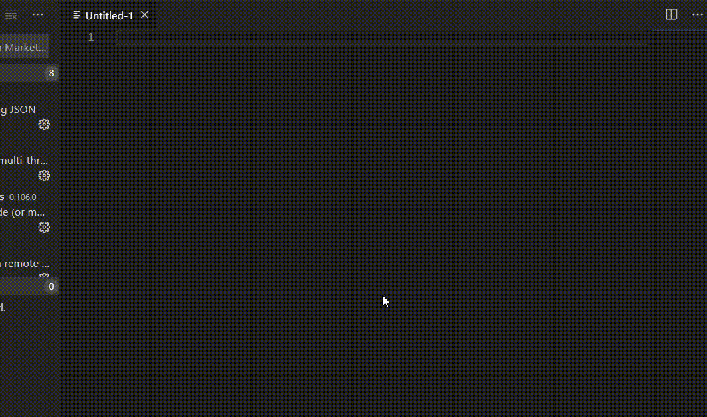

# Syntax Highlighter for AppShape++
Visual Studio Code custom syntax pack for Alteon AppShape++ scripting

## Table Of Contents ###
- [Description](#description )
- [How To Use](#how-to-use )
  * [Import Into vscode](#import-into-vscode)
  * [Usage](#usage)
  * [Example](#example)


## Description ##
This repository holds the Alteon AppShape++ scripting (mostly TCL) package for vscode Text editor.<br>
Using this package vscode will be able to auto-complete known AppShape++ commands, apply coloring scheme as well as suggest command snipets<br>

## How To Use ##
### Import Into vscode ###
in order to use this package download the content of this Git into the package directoy used by vscode<br>
you can easly find the directory by navigating to `View > Command Palette` type `open extensions folder`<br>

In order to make use of the color scheme, please locate the current theme (default is dark+) configuration file 
for windows users: `%localappdata%\Programs\Microsoft VS Code\resources\app\extensions\theme-defaults\themes`
Add reference to the new coloring scope in the following manor:
```
...
    "tokenColors": [{
            "name": "AppShape++ Commands",
            "scope": ["command.classcommand.appshape"],
            "settings": {
                "foreground": "#90ee90"
            } 
        },
..
```

### Usage ###
the package is applyed in the following cases
* file with `.appshape` extention
* manual language mode change using `CTRL+SHIFT+P` for Windows or `CMD+SHIFT+P` for MacOS.

### Example ###

